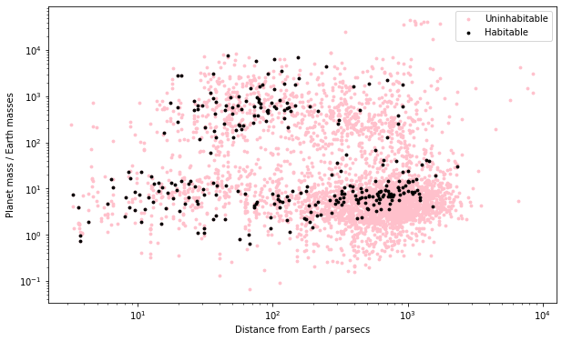

# Habitable Exoplanets: Assessing the Potential for Surface Water

The dataset used in this notebook is from the [NASA exoplanet archive](https://exoplanetarchive.ipac.caltech.edu). Here, planets are considered ‘habitable’ if liquid water could exist on their surface. At temperatures greater than 100°C, water boils. At temperatures below 0°C, water freezes. This means for a planet to be deemed 'habitable', it must have a surface temperature between 0°C (273.15 K) and 100°C (373.15 K). The distance modulus equation is used to determine the distance of exoplanets from Earth. This value is then applied to calculate the luminosity, which in turn is used to estimate the temperature of the star. From these constants, the surface temperature can be approximated. 
    
This project explored the use of python notebooks (.ipynb); hence, the full write up is contained within the attached file.
    

 
**Figure 1**: planet mass against distance from Earth for all 'habitable' and 'uninhabitable' exoplanets.

  
Of the 3936 planets investigated, 283 have been deemed habitable on the basis that they lie within an accepted range of temperatures in which liquid water could exist on the surface of the planet. In reality, more variables are required to be looked at to determine whether a planet can be lived on. Examples of this are atmospheric pressure and the amount of carbon dioxide in the atmosphere. Therefore, the true amount of habitable exoplanets will be less than 283.
